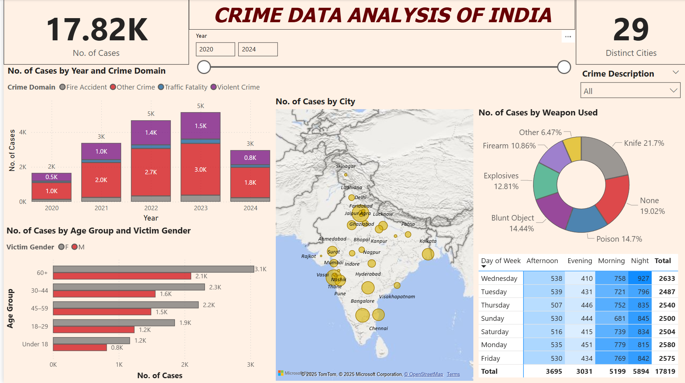
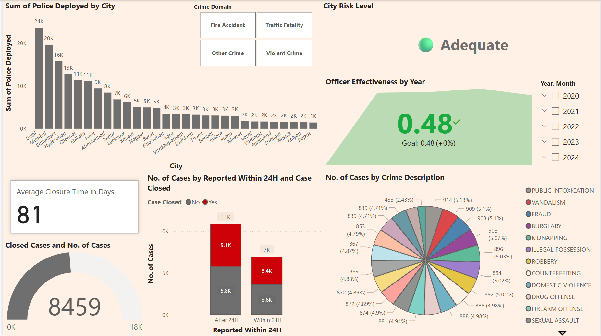

# Crime Data Analysis of India  
**Insight into Indian Crime Trends: An interactive Power BI report to explore patterns, hotspots, and enforcement effectiveness.**

---

## 1. Purpose  
The Crime Data Analysis Dashboard is an interactive Power BI report built to turn raw crime data from major Indian cities into actionable insights. It helps law enforcement agencies, policymakers, and public safety analysts understand temporal and spatial crime patterns, victim demographics, weapon usage, and police response effectiveness.

---

## 2. Tech Stack  
- 📊 **Power BI Desktop** – Main visualization platform for designing interactive reports.  
- 🔄 **Power Query** – Data ingestion, cleansing, and reshaping.  
- 🧮 **DAX (Data Analysis Expressions)** – Calculated measures, dynamic filtering, and conditional logic.  
- 📐 **Data Modeling** – Relationships between tables (crime incidents, police deployment, demographics, weapons).  
- 💾 **File Format** – `.pbit` for the dashboard; `.png` for embedded previews in this repository.

---

## 3. Data Source

> **Disclaimer:** This dataset is **not an official release** from the National Crime Records Bureau (NCRB). It is a **mock dataset** designed to resemble NCRB-style records for **educational and analytical purposes only**.

### Primary (Simulated) Source:
- **Mock NCRB-style Dataset** – Simulated city-level crime incident data for the years **2020–2024**, modeled after typical formats found in public crime statistics reports.

---

## 4. Features / Highlights  

### Business Problem  
Extensive crime data exists across Indian cities but lacks meaningful visualization, making it hard for stakeholders to devise targeted safety strategies.

### Goal of the Dashboard  
- Provide an intuitive, interactive tool to explore crime trends by time, location, and category.  
- Support data-driven decision-making for resource allocation, rapid response, and policy formulation.

### Key Insights
- Crime rates peaked in 2022 across Tier-1 cities, particularly in cybercrime.
- Areas with higher police deployment showed better case closure rates.
- Weapon usage patterns vary drastically by crime domain and location.

### Walkthrough of Key Visuals  
1. **Cases by Year & Domain (Stacked Column)**  
   - Tracks Fire Accidents, Traffic Fatalities, Violent Crimes and Other Crimes from 2020 through 2024.  
2. **Geospatial Distribution (Map)**  
   - Bubble map of 29 cities sized by total case counts.  
3. **Weapon Usage (Donut Chart)**  
   - Breakdown of “Knife,” “None,” “Poison,” “Blunt Object,” “Explosives,” “Firearm” and “Other.”  
4. **Time-of-Day & Day-of-Week (Heat Table)**  
   - Hourly and weekday crime density with totals (17,819 cases in current filter).  
5. **Victim Demographics (Bar by Age & Gender)**  
   - Shows highest case volumes in age groups 60+ and 30–44, with gender split.  
6. **Police Deployment (Bar by City)**  
   - Officers deployed across cities, filterable by crime domain.  
7. **Officer Effectiveness (KPI & Area Chart)**  
   - Overall closure rate at 0.48 (meets 0.48 goal).  
8. **Closure & Reporting Delay**  
   - Avg. closure time 81 days; cases closed vs. reported within 24 hrs.  
9. **Crime Description (Pie Chart)**  
   - Top 20 crime types by count (e.g., Vandalism, Fraud, Burglary, etc.).  

---

## 5. Screenshots / Demo  
  
*Combined view of case counts by year & domain, city map, weapon usage and time-of-day heatmap.*

  
*KPI cards, police deployment by city, officer effectiveness, closure-time gauge, and crime-type breakdown.*

---
## 6. How to Use

### 1. Clone this repository

git clone [https://github.com/<your-username>/crime-data-analysis-india.git](https://github.com/adityaa05/crime-data-analysis-india.git)

### 2. Open the Power Bi Dashboard

Launch the `Dashboard/Crime_Data_Dashboard.pbit` file using **Power BI Desktop**.

### 3. Prepare the Data Folder

Make sure the `Data/` folder contains the following file:

- Data/crime_incidents.csv

### 4. Refresh the Data Connection

In Power BI, click the **Refresh** button to load the latest data from the CSV files into the dashboard.

### 5. Explore the Dashboard

Use the available **slicers** in the dashboard to filter and analyze data by:

- Year  
- City  
- Crime Domain  
- Crime Description

---
## 👥 7. Contributors

- Aditya Patil
- Ayush Vishwakarma
- Shreya Singh  
- Neha Urankar  
- Yash Tapre    
- Pratik Gouda

